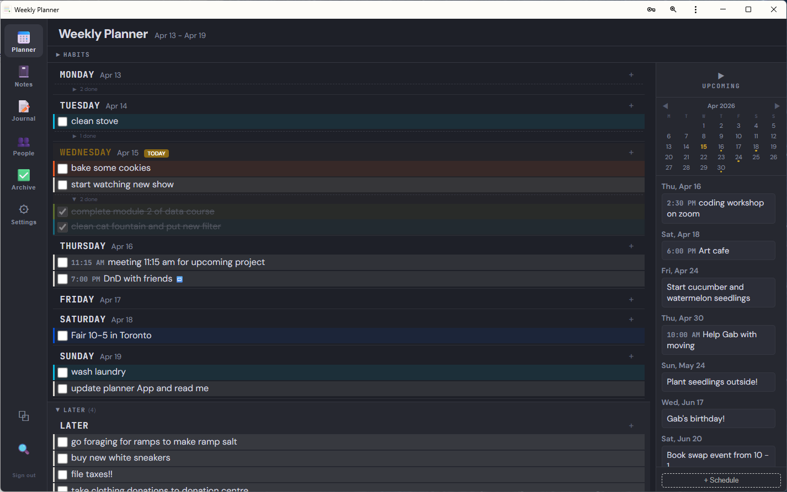

# Weekly Planner

A personal weekly planner and productivity app that syncs across all your devices. Built as a Progressive Web App (PWA) with Firebase for real-time cloud sync.

<!-- Replace with your own screenshot of the main planner view -->


## Features

### Weekly Task Planner
Organize your week with a clean day-by-day view. Add tasks to any day, drag and drop them between days, and check them off when done. Tasks that aren't completed by the end of the week automatically carry forward to Monday of the next week, so nothing gets lost.

<!-- Replace with a screenshot showing tasks with category colors -->


### Two Layout Options
Choose the view that works best for you in Settings:
- **Vertical layout** stacks days top to bottom as a scrollable list, similar to a to-do app. Each day is a full-width section with tasks listed below it.
- **Horizontal layout** arranges days side by side as columns, like a traditional weekly planner. Drag the edge of any column to resize all columns at once, and scroll horizontally if you widen them beyond the screen.

Your layout preference syncs across devices.

<!-- Replace with a screenshot showing horizontal column layout -->


### Smart Categories with Auto-Detection
Tasks are automatically color-coded by category based on keywords in the task name. Type "cook dinner" and it detects Cooking. Type "water the plants" and it picks Gardening. Type "sporas meeting" and it assigns Sporas. You can always override the detected category manually by clicking the palette icon on any task.

Create your own custom categories with any name and color from a 32-color palette in the Settings tab. Default categories include: Cleaning, Cooking, Learning, Crafts/Art/Reading, Sporas, Events, Volunteering, Gardening, and Other.

Each task shows its category as a colored left stripe and a subtle background tint, making it easy to scan your week and see how your time is distributed.

### Later List
A dedicated section for tasks you want to remember but haven't scheduled yet. Tasks in Later are intentionally uncategorized. When you drag them into a specific day, they get auto-categorized based on their name. The Later section is resizable by dragging the handle above it.

### Upcoming Tasks and Birthday Reminders
Schedule tasks for future weeks in the Upcoming sidebar. When a scheduled week arrives, those tasks automatically move to the correct day in your planner with their category auto-detected. Hit Enter to save an upcoming task quickly without clicking the Add button.

**Birthday reminders:** When you add a birthday to someone's contact card (in the People tab), the app automatically creates an upcoming task reminder 2 weeks before their birthday, complete with a cake emoji. These show up in the Upcoming sidebar and auto-promote to your planner when the week arrives.

### Daily and Weekly Habits
Track recurring habits with a checkbox grid. Daily habits show a Mon through Sun row of checkboxes. Weekly habits are a simple checklist. Habit names persist across weeks, only the checkboxes reset each Monday.

Double-click any habit name to edit it. Drag the divider between the Daily and Weekly sections to give either side more space. On mobile, habits get their own dedicated tab with large, touch-friendly checkboxes.

<!-- Replace with a screenshot of the habits tracker section -->


### Rich Text Notebooks
A built-in notes system with multiple notebooks. Each notebook has a rich text editor supporting bold, italic, underline, strikethrough, highlights, text colors, links, lists, and image pasting.

**Dynamic tables:** Insert a table (starts as 2x2), then use the toolbar buttons to add or remove rows and columns as needed. Drag the edge of any cell to resize column widths. Hover over a cell to see a highlight showing which cell you're in.

Notebooks are listed in a collapsible sidebar on the left. Drag to reorder them however you want. Double-click a notebook name to rename it.

<!-- Replace with a screenshot of the notebooks panel -->


### Daily Journal
Write daily journal entries with the same rich text editor. A mini calendar on the side shows green dots on days with entries, making it easy to navigate your history. The calendar sidebar is collapsible if you want the full width for writing.

<!-- Replace with a screenshot of the journal panel -->


### People / Contacts
Keep track of people in your life with expandable cards. Store names, birthdays, likes, dislikes, relationship notes, and general notes. Searchable and always accessible. Birthdays you enter here automatically generate reminder tasks in the Upcoming sidebar.

### Task Archive
Every task you complete gets logged in the archive with its category badge, assigned date, and completion date. The last 500 completed tasks are kept for reference.

### Dark Mode
Full dark theme that applies to every part of the app, including all tabs, editors, and the mobile view. Toggle it in Settings and it syncs across devices.

<!-- Replace with a screenshot of the app in dark mode -->


### Resizable Sections
The Later section and Notes section at the bottom of the planner are both resizable. Drag the handle between sections to give either one more or less space. Each section has a minimum height so it doesn't collapse too small.

### Global Search
Click the search icon to search across everything: tasks, completed tasks, upcoming tasks, notebooks, journal entries, contacts, habits, and notes. Results show which section each match came from.

### Mobile Friendly
On phones (screens under 640px), the app automatically switches to a mobile-optimized layout:
- Bottom navigation bar instead of the left sidebar
- Larger text (16px) and bigger touch targets for checkboxes and buttons
- Dedicated Habits tab with large, tappable checkboxes
- Simplified single-column vertical layout
- Later section flows inline at the bottom of the day list
- Quick notes section at the bottom

All inputs are 16px to prevent iOS auto-zoom on focus.

<!-- Replace with a screenshot of the app on a phone -->


### Cross-Device Sync
Sign in with the same account on your phone, laptop, tablet, or any device with a browser. All your tasks, habits, notebooks, journal entries, contacts, categories, and settings sync in real time through Firebase.

### Installable PWA
Install the app on your home screen (phone) or taskbar (desktop) for a native app-like experience. Works in Chrome, Edge, and Firefox on Windows.

## Tech Stack

- **Frontend:** React (Vite), inline styles, no external UI library
- **Backend:** Firebase (Authentication, Firestore, Storage)
- **Hosting:** Vercel (free tier)
- **PWA:** vite-plugin-pwa with service worker for offline caching

## Quick Start

To get the app running, you'll need Node.js, a Firebase account (free), and a GitHub account (free). The basic steps are:

1. Set up a Firebase project with Authentication and Firestore
2. Clone the repo and add your Firebase config to `src/firebase.js`
3. Run `npm install` then `npm run dev` to test locally
4. Push to GitHub and connect to Vercel for free hosting
5. Install on your devices as a PWA

For detailed step-by-step instructions, see the [Setup Guide](SETUP_GUIDE.md).

## Development

### Running locally

```
npm install
npm run dev
```

This starts a local dev server at `http://localhost:5173`. Always test changes locally with `npm run dev` before deploying.

### Deploying changes

```
git add .
git commit -m "description of changes"
git push
```

Vercel automatically deploys from GitHub within about a minute. If the deployed version doesn't update right away, do a hard refresh (`Ctrl + Shift + R`).

### Project structure

```
src/
  App.jsx              - Auth wrapper, passes data to Planner
  Planner.jsx          - Main app: task management, habits, settings, layout
  usePlannerData.js    - Firebase data layer, sync logic, carry-forward
  NotebooksSidebar.jsx - Rich text notebooks with drag-to-reorder
  JournalPanel.jsx     - Daily journal with mini calendar
  ContactsPanel.jsx    - People/relationships tracker
  LoginScreen.jsx      - Email/password auth screen
  useAuth.js           - Firebase auth hook
  firebase.js          - Firebase config (your project credentials)
  main.jsx             - Entry point
index.html             - HTML shell with viewport and global styles
vite.config.js         - Vite + PWA plugin config
SETUP_GUIDE.md         - Detailed setup and deployment instructions
```

## Adding Screenshots

To add screenshots to this README:

1. Create a `screenshots/` folder in the project root
2. Take screenshots of the app and save them as:
   - `planner-view.png` (main weekly view with tasks in vertical layout)
   - `tasks-categories.png` (close-up showing category color stripes)
   - `layout-options.png` (horizontal column layout)
   - `habits.png` (habits tracker with daily and weekly sections)
   - `notebooks.png` (notebooks panel with editor and a table)
   - `journal.png` (journal with calendar sidebar)
   - `dark-mode.png` (the app in dark mode)
   - `mobile.png` (the app on a phone screen)
3. The image references in this README will automatically pick them up
4. Commit the screenshots folder and push to GitHub

## License

This is a personal project. You own it completely. Do whatever you want with it.
