# Weekly Planner

**A personal productivity app that keeps your week organized across every device.**

Plan your tasks, schedule them by time, track habits, log your mood, write journal entries, manage contacts, and take notes, all in one place. Built as a Progressive Web App with Firebase sync and offline support.

<!-- Replace with your own screenshot -->
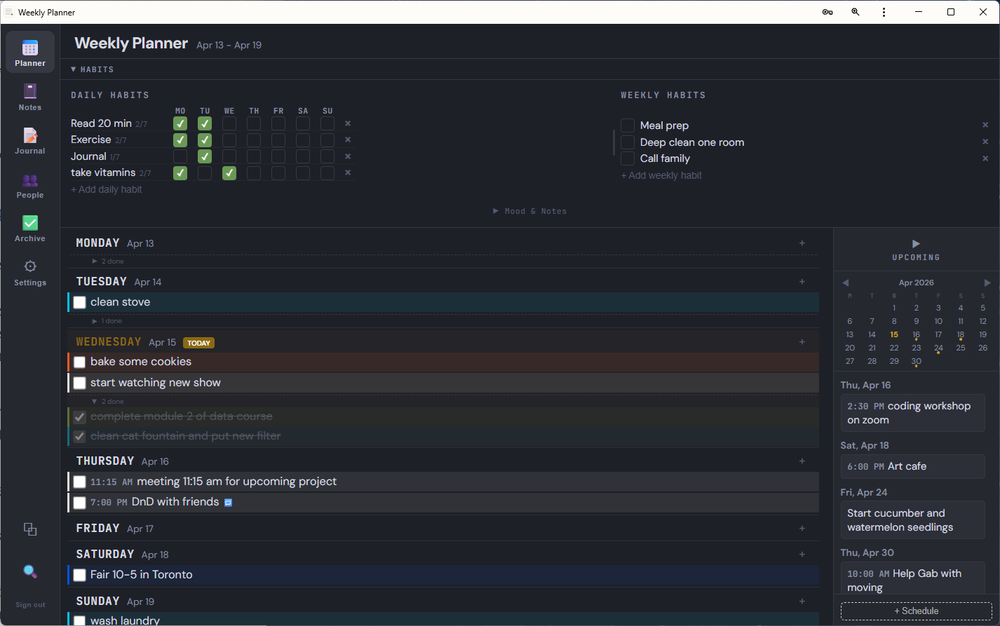

---

## At a Glance

| Feature | What it does |
|---|---|
| **Weekly Tasks** | Drag-and-drop tasks across days. Incomplete tasks carry forward automatically. Can set tasks that repeat weekly or monthly. |
| **Two Layouts** | Vertical list or horizontal columns with a time grid. Toggle from the sidebar. |
| **Time Scheduling** | Schedule tasks at specific times. Drag to time slots in horizontal view, or right-click to set a custom time anywhere. |
| **Smart Categories** | Auto-detects task type from keywords and color-codes it. Fully customizable. |
| **Auto Time Detection** | Type "1pm meeting" or "lunch 2:30-3:30" and the app schedules it automatically. |
| **Habits** | Daily checkbox grid (Mon-Sun) and weekly checklist. Editable, resizable. |
| **Mood & Notes** | Track how you felt each day with emoji moods and short notes. |
| **Notebooks** | Rich text editor with dynamic tables, images, highlights, and color. |
| **Journal** | Daily entries with a mini calendar showing your writing history. |
| **People** | Contact cards with birthdays that auto-generate upcoming reminders. |
| **Dark Mode** | Full dark theme across every screen. Syncs with your preference. |
| **Mobile** | Responsive layout with bottom nav, large touch targets, and long-press menus. |
| **Offline Support** | Firestore persistent local cache. Edit while offline, syncs when reconnected. |
| **Sync** | Across all devices via Firebase. |

---

## Features

### Task Management

Organize your week with drag-and-drop. Add tasks to any day, reorder them, and check them off. Done tasks fade and collapse below a "X done" toggle. Anything unfinished at the end of the week carries forward to Monday automatically.

**Later list** holds tasks you haven't scheduled yet. They stay uncategorized until you drag them into a day, at which point the category is auto-detected.

**Upcoming sidebar** lets you schedule tasks for future weeks. They auto-promote to the correct day when that week arrives. Each task supports text, date, and an optional time.

### Time Scheduling

Tasks can have specific times attached, displayed as a small badge before the task text (e.g., "1:00 PM make Chaga tea"). Times sync across all views.

**Three ways to set a time:**

1. **Drag to time slot** (horizontal view): Drop a task on the time grid. Snaps to 15-minute slots. Default duration is 15 minutes; drag the bottom edge to resize.
2. **Right-click "Set time"** (any view): Opens a small time picker. Works on scheduled tasks, unscheduled tasks, and upcoming tasks.
3. **Type it in the task text**: Auto-detected when you create a task. See "Auto Time Detection" below.

**Custom durations** via ranges: scheduling "lunch 2:30-3:30" sets both start (2:30 PM) and end (3:30 PM) times. Single times default to a 15-minute block.

Right-click any scheduled task and pick "Remove time" to unschedule without deleting.

Mobile uses long-press (500ms) instead of right-click to open the same context menu.

### Auto Time Detection

When you add a task, the text is parsed for time patterns. If found, the time is set automatically and the time text is cleaned out of the task name.

| You type... | Becomes |
|---|---|
| "1pm meeting" | "meeting" scheduled at 1:00 PM (15 min) |
| "lunch 2:30-3:30" | "lunch" scheduled 2:30-3:30 PM |
| "13:30 call" | "call" scheduled at 1:30 PM (24-hour format) |
| "follow up at 2pm" | text unchanged, time set to 2:00 PM (mid-string time stays in text) |
| "review chapter 2" | no time detected (bare numbers ignored) |

Detection only runs at task creation, not when renaming. Set or remove times manually via right-click after that.

### Smart Categories

Type a task name and the app detects the category from keywords:

| You type... | Detected as |
|---|---|
| "cook dinner" | Cooking |
| "vacuum living room" | Cleaning |
| "water the garden" | Gardening |
| "volunteer at market" | Volunteering |
| "study for exam" | Learning |

Each task shows a colored left stripe and a subtle background tint. Override any detection by clicking the palette icon on hover. Create custom categories with any name and color from a 32-color palette in Settings.

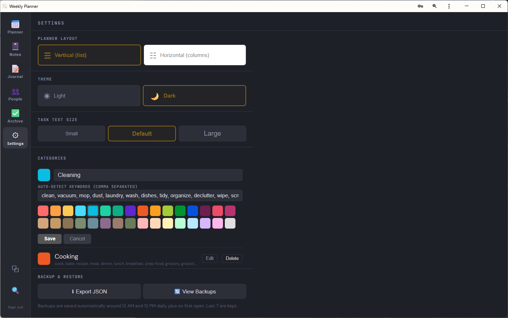

### Two Layout Options

| Vertical (list) | Horizontal (with time grid) |
|---|---|
| Days stacked top to bottom | Days side by side, with a 24-hour time grid above |
| Scrolls vertically | Time grid for scheduled tasks, unscheduled tasks listed below |
| Clean, focused, minimal | Visual day-planner feel with timeline blocks |
| Best for phones and laptops | Best for wide monitors |

A toggle button in the left sidebar (above the search icon) flips between the two layouts in one click. Your preference syncs across devices.

In horizontal mode, drag handles at the top and bottom of the time grid let you hide early-morning or late-night hours.

<!-- Replace with a screenshot showing horizontal column layout -->
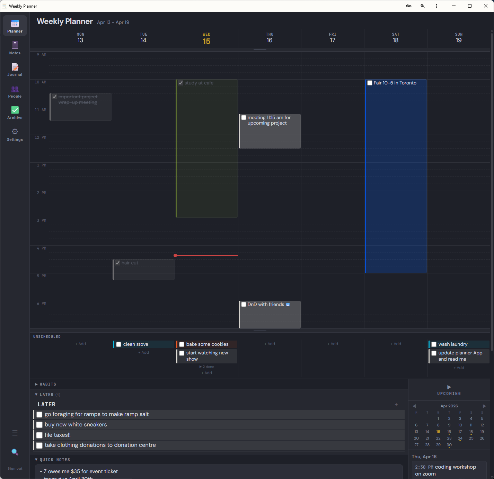

### Anchor-Based Task Ordering

In vertical view, scheduled tasks are sorted by time automatically. Unscheduled tasks can be dragged anywhere in the list and they "anchor" to the nearest scheduled task above them.

This means:
- Switching between layouts many times a day doesn't reset your manual ordering
- Rescheduling a task moves its anchored unscheduled tasks along with it
- Dragging an unscheduled task between two scheduled ones keeps it there permanently

### Habits

**Daily habits** show a Mon through Sun checkbox grid. **Weekly habits** are a simple checklist. Habit names persist across weeks; only the checkboxes reset each Monday.

- Double-click any habit name to edit it
- Drag the divider between daily and weekly sections to resize
- On mobile, habits get their own tab with large, tappable checkboxes

### Mood & Notes

A collapsible section below the habits with a 7-face week view. Each day of the week gets an empty face slot. Click any past or current day to pick from 6 mood emojis (😊 great, 🙂 good, 😐 neutral, 😔 low, 😩 drained, 😡 angry) and add a short note explaining why.

- Past days remain editable (catch up on the days you missed)
- Days with notes show a 💬 indicator below the face — click to see the note in a popup
- Section is collapsed by default; the open/closed state is remembered per-device

The data is stored per-date so it survives across weeks and lets you look back at "why was last Tuesday so bad?"

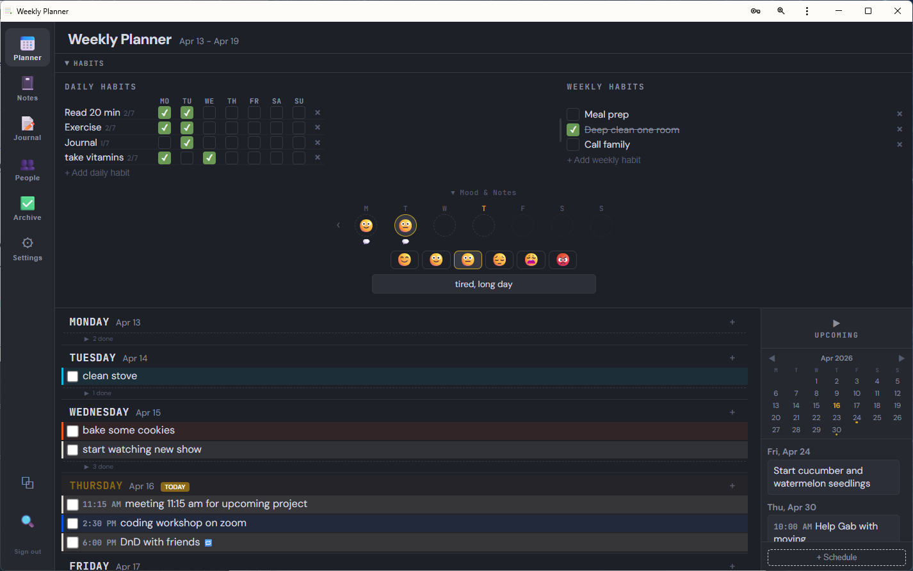

### Rich Text Notebooks

A built-in notes system with multiple notebooks and a full rich text editor.

**Editor toolbar:** bold, italic, underline, strikethrough, highlight colors, text colors, links, images, bullet lists, numbered lists, and tables. Keyboard shortcuts include Ctrl+Shift+8 for bullet lists and Ctrl+Shift+7 for numbered lists.

**Dynamic tables:** Insert a 2x2 table, then use toolbar buttons to add or remove rows and columns. Drag cell edges to resize column widths. Hover highlights which cell you're in.

Notebooks are listed in a collapsible sidebar. Drag to reorder. Double-click to rename.

<!-- Replace with a screenshot of the notebooks panel -->
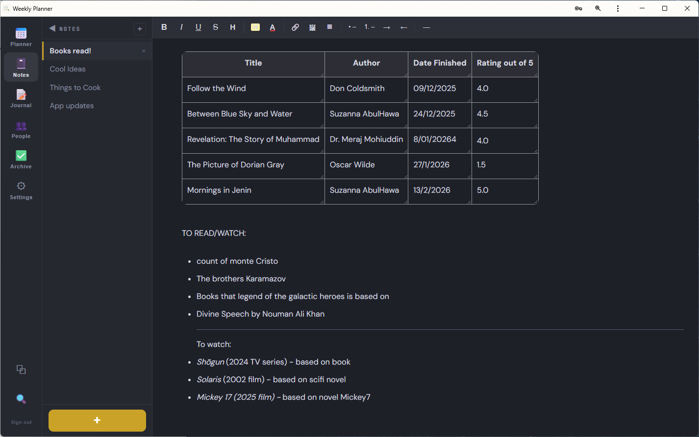

### Journal

Write daily entries with the same rich text editor. A mini calendar shows green dots on days you've written, making it easy to look back. The calendar sidebar collapses if you want full-width writing space.

Mobile shows a feed-style view with 4-line previews of recent entries. Tap any entry to expand and edit.

<!-- Replace with a screenshot of the journal -->
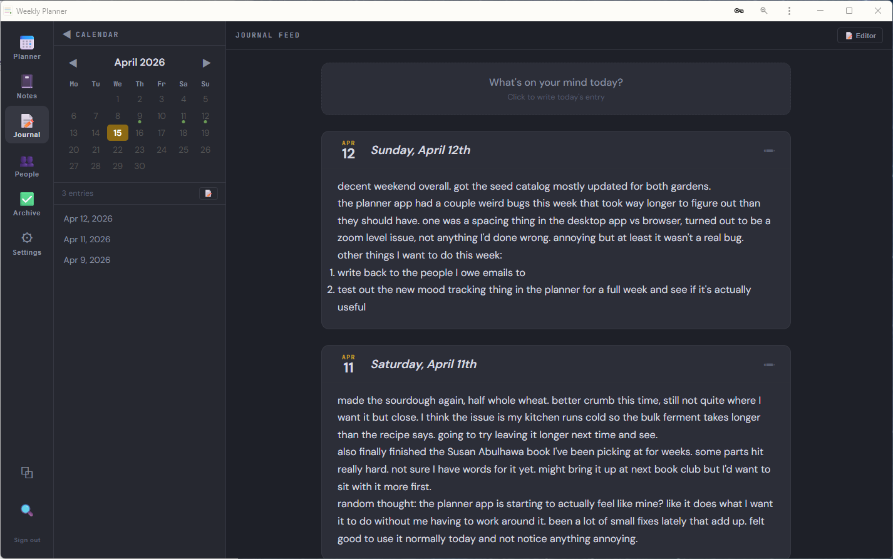

### People and Birthday Reminders

Keep track of people with expandable contact cards: name, birthday, likes, dislikes, relationship, and notes. Searchable.

When you add a birthday to a contact, the app automatically creates an upcoming task reminder dated on their actual birthday. The reminder only appears in the Upcoming sidebar starting 2 weeks before the date, so it surfaces at just the right time.

### Recurring Tasks

Right-click any task and pick "Set recurring" to make it repeat weekly, biweekly, or monthly. The task auto-creates on the right day going forward. Multi-device safe, with a sequential write queue to prevent duplicates when multiple devices sync at the same time.

### Archive

Every completed task is logged with its category, assigned date, and completion date. Some simple state such as number of tasks completed within past 7 days and 30 days is shown, as well as average number of tasks completed per week. Track your habit building progress by comparing your daily and weekly habit completion for the previous 4 weeks. 

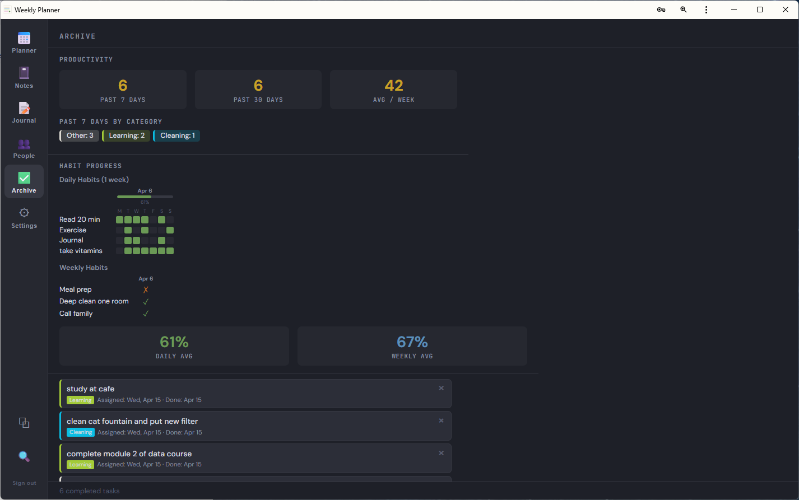

### Dark Mode and Light Mode

Full dark and light theme across the entire app, including all tabs, editors, popups, and mobile views. Toggle in Settings. Syncs across devices.

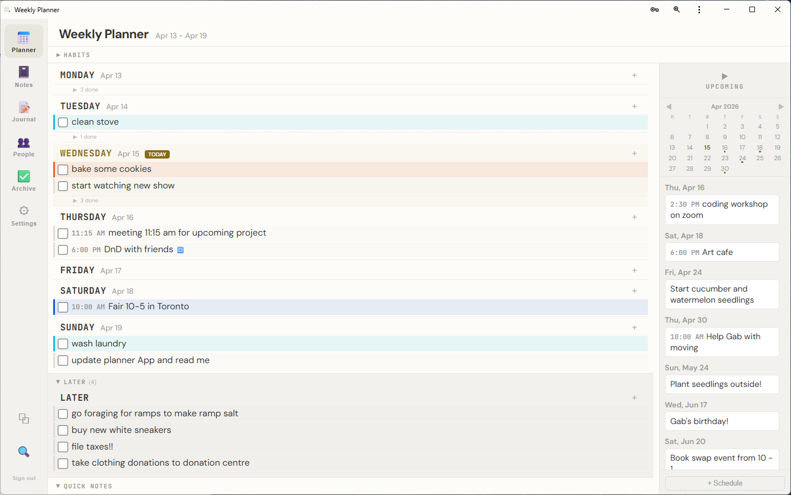

### Global Search

Search across everything at once: tasks, completed tasks, upcoming, notebooks, journal entries, contacts, habits, and notes. Results show which section each match came from.

### Undo

Press Ctrl+Z (Cmd+Z on Mac) to undo the last destructive action — task deletion, completion toggle, or upcoming task removal. The previous state of tasks, archive, and future tasks is captured before the change.

### Mobile

On screens under 640px, the app switches to a mobile-optimized layout:

- Bottom navigation bar
- Larger text (16px) and bigger checkboxes
- Dedicated Habits tab with tappable checkboxes
- Vertical list layout (always)
- Long-press (500ms) on any task to open its context menu (set time, edit, delete, etc.)
- Later and Notes inline at the bottom
- Inputs sized to prevent iOS auto-zoom
- Mobile upcoming view supports the same set-time / edit / delete options as desktop

<p align="center">
  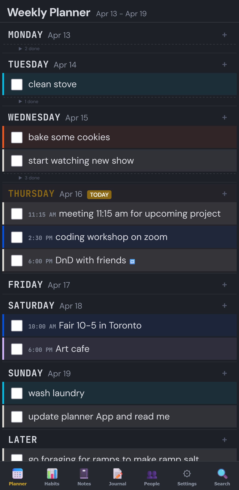
  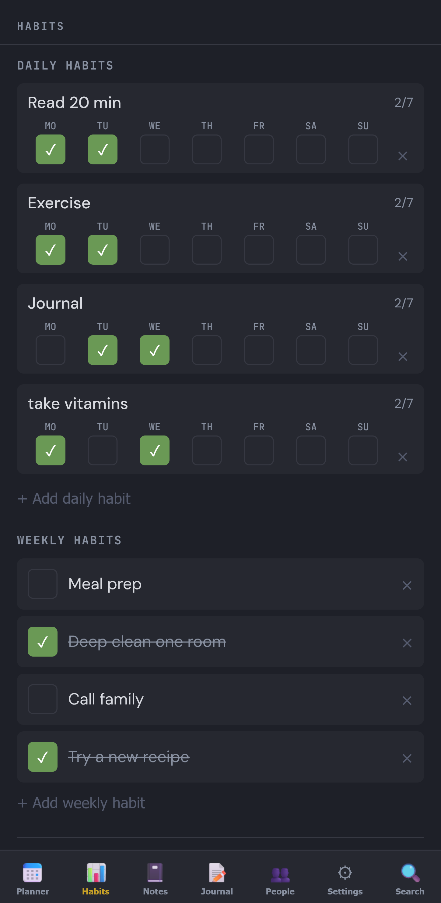
  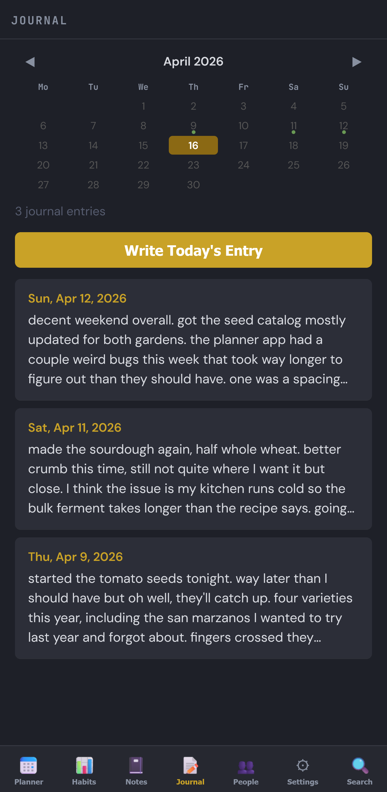
  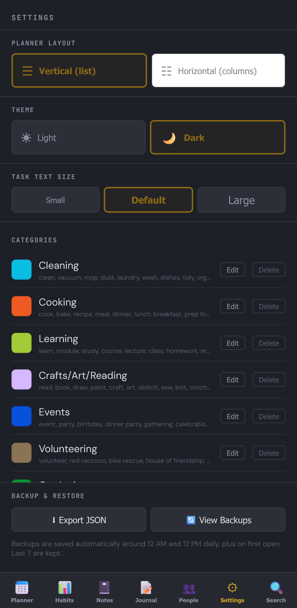
</p>

### Cross-Device Sync

Sign in on your phone, laptop, tablet, or anything with a browser. Tasks, habits, notebooks, journal, contacts, categories, moods, and settings all sync across devices.

### Offline Support

Firestore is configured with persistent local cache. Once you've loaded the app once with internet, you can:

- Continue using it offline indefinitely (with the caveat that browser storage isn't guaranteed permanent)
- Make edits while offline — they queue locally and sync when reconnected
- Open multiple tabs without breaking the cache

The app also requests persistent storage permission to reduce the chance of the browser evicting cached data.

### Installable PWA

Add to your home screen (phone) or taskbar (desktop) for a native app feel. Works in Chrome, Edge, and Firefox on Windows.

---

## Tech Stack

| Layer | Technology |
|---|---|
| Frontend | React (Vite), inline styles |
| Backend | Firebase Auth, Firestore (persistent local cache), Storage |
| Hosting | Vercel (free tier) |
| PWA | vite-plugin-pwa, service worker |

---

## Quick Start

1. Set up a Firebase project with Authentication and Firestore
2. Clone the repo and add your Firebase config to `src/firebase.js`
3. Run `npm install` then `npm run dev` to test locally
4. Push to GitHub and connect to Vercel for free hosting
5. Install on your devices as a PWA

For full step-by-step instructions, see the **[Setup Guide](SETUP_GUIDE.md)**.

---

## Development

```bash
# Install dependencies
npm install

# Start local dev server at http://localhost:5173
npm run dev

# Deploy (after testing locally)
git add .
git commit -m "description of changes"
git push
```

Vercel auto-deploys from GitHub within a minute. Hard refresh (Ctrl+Shift+R) if you see a cached version.

### Project Structure

```
src/
  Planner.jsx          Main app: tasks, habits, mood, settings, layouts
  usePlannerData.js    Firebase data layer, sync, carry-forward, recurring rules
  NotebooksSidebar.jsx Rich text notebooks with tables
  JournalPanel.jsx     Daily journal with mini calendar
  ContactsPanel.jsx    People/contacts tracker
  App.jsx              Auth wrapper
  LoginScreen.jsx      Login/signup screen
  useAuth.js           Firebase auth hook
  firebase.js          Your Firebase config + persistent cache setup
  main.jsx             Entry point

index.html             HTML shell, viewport, global styles
vite.config.js         Vite + PWA config
SETUP_GUIDE.md         Detailed setup instructions
```

---

## Screenshots

To add your own screenshots, create a `screenshots/` folder and save images with these names:

| Filename | What to capture |
|---|---|
| `planner-view.png` | Main weekly view with tasks |
| `tasks-categories.png` | Tasks showing category color stripes |
| `layout-options.png` | Horizontal column layout with time grid |
| `habits.png` | Habits section with daily and weekly |
| `mood.png` | Mood tracker with the 7-face week view |
| `notebooks.png` | Notebook editor, ideally with a table |
| `journal.png` | Journal with calendar sidebar visible |
| `dark-mode.png` | Any view in dark mode |
| `mobile.png` | The app on a phone |

Then commit and push. GitHub renders them automatically.

---

## License

This is a personal project. You own it completely. Do whatever you want with it.
